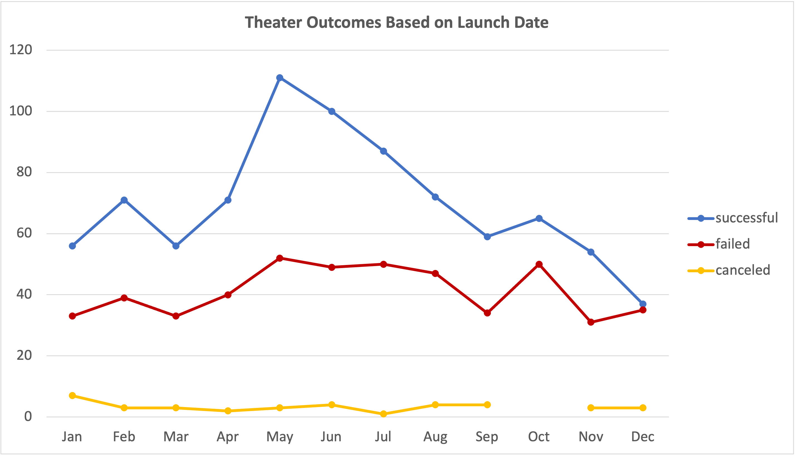

# Kickstarting with Excel

## Overview of Project

### Purpose

The following analysis was performed to provide Louise, who is interested in raising funds for her play, with insight into fundraising campaign outcomes based on factors such as the launch date of the campaign and the fundraising goal of the campaign.  This analysis was based on a Kickstarter data set of 1,413 campaigns launched between 2009 and 2017 across various fundraising categories and in multiple countries. Specific analyses in this report may have used a smaller segment of the population data to derive more targeted insights.
  
## Analysis and Challenges

### Analysis of Outcomes Based on Launch Date

An initial analysis of campaign outcomes based on launch date was prepared. To prepare the Kickstarter dataset for this analysis:

- the 'launched_at' date in unicode format from the original Kickstarter data set had to be converted to a human-readable date.  This was accomplished by adding a new column called 'Date Created Conversion' using the formula `=J2/60/60/24 + DATE(1970,1,1)` where 'J2' refers to the date field in unicode format.

- to enable the final analysis to be able to be filtered by launch year, an additional calculated column called 'Years' was added using the formula `=YEAR(S2)` where 'S2' refers to the 'Date Created Conversion' field.

A pivot table was created based on the enhanced Kickstarted data, with filters for 'Parent Category' and 'Years', and with the count of outcomes displayed by 'Outcome' in the columns and by month of launch date in the rows.  As we were only concerned with completed campaigns, the 'Live' campaigns were filtered out of the Outome columns. The 'Parent Category' was filtered to 'theater' which is the category most relevant to Louise, as she considers her campaign to fund a play.

At this point the data for the analysis was displayed in tabular form, but to enable more visually intuitive understanding of the data, a line chart was created:

### Analysis of Outcomes Based on Goals

A second analysis of campaign outcomes was prepared to better understand the success and failure of fundraising campaigns for plays based on the size of the fundraising goal. In this analysis we were specifically interested in understanding the number and percentage of successful, failed, or canceled campaigns by the below goal ranges:

* Less than 1000
* 1000 to 4999
* 5000 to 9999
* 10000 to 14999
* 15000 to 19999
* 20000 to 24999
* 25000 to 29999
* 30000 to 34999
* 35000 to 39999
* 40000 to 44999
* 45000 to 49999
* 50000 or More

The number of successful, failed, or canceled campaigns for this analysis was compiled by writing 'sumifs' formulas against the original Kickstarter data set.
For example, the calculation for the number of failed campaigns with a goal of raising between $10,000 to $14,999 is: `=COUNTIFS(Kickstarter!$F:$F,"failed",Kickstarter!$D:$D,">=10000",Kickstarter!$D:$D,"<14999.99",Kickstarter!$R:$R,"plays")`.

With the counts in hand, a simple summation formula was added to the table of data total all successful, failed and canceled campaigns: `=SUM(B2:D2)` and percentages were calculated based on the count of successful, failed or canceled campaigns divided by the total campaigns: `=IFERROR(B2/E2,0)`.

A line chart to display the tabular data provides for a more intuitive understanding:

### Challenges and Difficulties Encountered

In preparing the above two analyses, a couple of small challenges were encountered:

- When preparing the pivot table analysis of Theater Outcomes by Launch date, upon adding 'Date Created Conversion' to the pivot table rows, additional calculated date fields were also added to the pivot table.  While unexpected, it was easy to simply drag the new fields for 'Years2' and 'Quarters' back to the field list.  The fact that these fields were added automatically indicated to me that it was unnecessary for us to have added the calculated column for 'Years' earlier in our data preparation.  However, the field could be useful for other analyses not based on a pivot table.

- Preparation of the tabular data for 'Outcomes based on Goals' was not difficult for me.  I have experience using sumifs formulas and was familiar with the syntax and understood the desired outcome.  My experience has also taught me that it is important to cross-check the results you are getting from a formula like sumifs to ensure that the formula is giving the expected results.  I completed my cross check as follows:
  - After writing all formulas to calculate the number of successful campaigns for each goal range, I added a total for all successful campaigns.  At that time, my total was 693 campaigns.  
  - Earlier in our homework, we created a 'Subcategory Statistics' report which showed the total number of successful (or failed, canceled or live) campaigns for any selected subcategory.  This report showed that the total successful campaigns was 694.  I was missing one campaign.
  - I reviewed my formulas again, looking for an error that could explain the missing campaign and noticed that I had assumed that all campaigns would be in whole dollar values!  I changed my formula from `=COUNTIFS(Kickstarter!$F:$F,"successful",Kickstarter!$D:$D,">=1000",Kickstarter!$D:$D,"<4999",Kickstarter!$R:$R,"plays")` to `=COUNTIFS(Kickstarter!$F:$F,"successful",Kickstarter!$D:$D,">=1000",Kickstarter!$D:$D,"<4999.99",Kickstarter!$R:$R,"plays")` which provided the expected data.
  - I completed the table for failed and canceled campaigns applying similar formula logic and again validated all totals, which were accurate.

## Results

### What are two conclusions you can draw about the Outcomes based on Launch Date?

We can draw the following conclusions about Outcomes based on Launch Date:
1. The month of May has the most successful campaigns, and while it also has the most failed campaigns, there are proportionally more successes in that month, as evidenced both by the peak on the 'successful' line in the month of May and the spread between the 'successful' and 'failed' lines in the month of May.

2. The months of November and December have fewer campaigns and proportionally higher failure rates, with December having nearly equal numbers of failed as successful campaigns, as evidenced by both the lower values plotted and the narrowing spread between the 'successful' and 'failed' lines.

### What can you conclude about the Outcomes based on Goals?

We can conclude that smaller fundraising goals are generally more successful than larger goals.  The 'Less than 1000' goals had the highest success rate at clost to 80% and the second highest success rate was delivered for goals between '1000 to 4999'.  The success rate generally trended downward for higher goals, except for goals between 35000 to 44999, which again had a higher success than failure rate.  Some additional analysis would need to be done on this segment of the data to understand if there were some unusual items driving this off trend result.
 
### What are some limitations of this dataset?

The dataset we are working with does not have many qualitative data points that might be useful to Louise as she attempts to develop her own successful campaign.  She may need to take some of the insights we can provide, e.g. most successful campaigns have smaller goals and launch in May, and then go to the kickstarter site to compare successful and unsuccessful small goals launched in May to look for other qualitative attributes, such as whether the project story includes compelling details, images and/or links to help determine what else may contribute to success.

### What are some other possible tables and/or graphs that we could create?

Even with the data that we do have available, it may be helpful to create some additional tables to better understand successful campaigns:

- We could modify the Theater Outcomes by Launch date and instead focus just on Plays to determine if the same launch date patters apply.

- We could add to the Outcomes based on Goals analysis to also determine the average contribution for successful vs failed campaigns.

- We might also want to calculate some statistical measures, e.g. a Box and Whiskers plot, on the average donations for successful campaigns, so that we know if there is a 'sweet spot' average donation amount regardless of goal size. We could compare the failed campaign average donations to see if they do fall in out outlier range of successful campaigns. If so, that would indicate that predicting the numbers of sponsors that Louise can attract will be an important factor in establishing a good campaign goal, where the average donation would be within the likely range.
